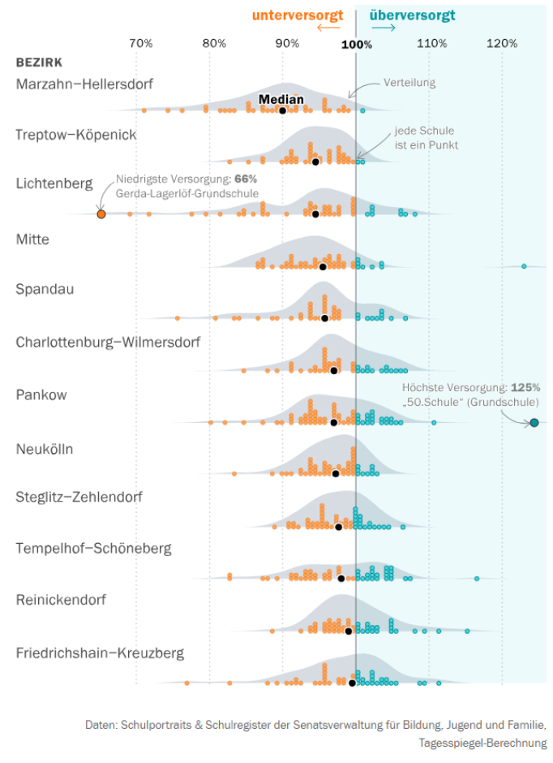
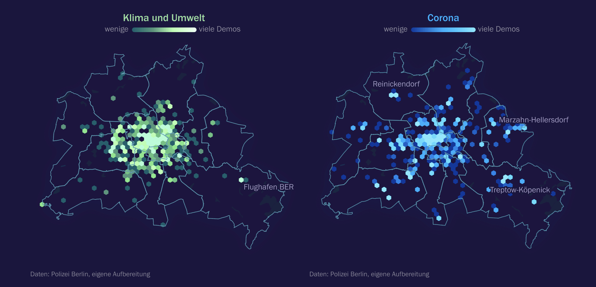
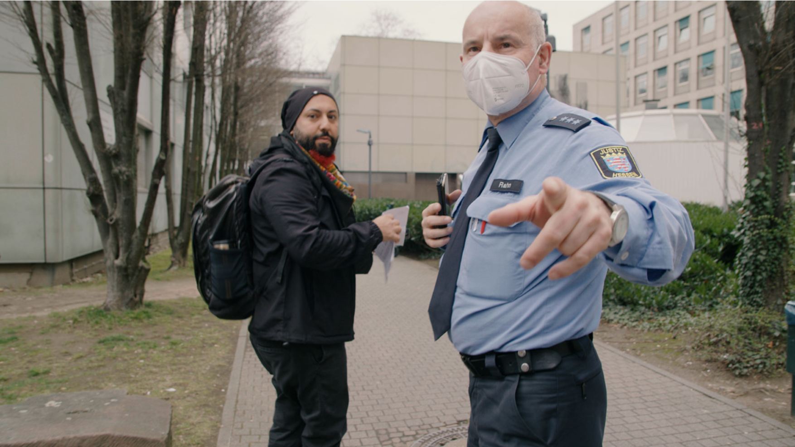

# Hi there 🌸
**Wie kann _Data Science_ genutzt werden, um strukturelle Ungleichheiten aufzudecken?** In meiner Arbeit versuche ich mithilfe von Daten Geschichten zu erzählen. Mich interessieren klassische Fragen der politischen Ökonomie und der Soziologie: Wie stabilisieren sich ökonomische und politische Systeme gegenseitig? Wie strukturiert Raum soziale Interaktion? Dabei untersuche ich sozio-ökonomische Ungleicheiten in Berlin und Deutschland. Aber auch, wie  Machtverhältnisse die Beziehungen zwischen Staaten, Unternehmen und Menschen strukturieren.

Hier findest du eine Auswahl von Artikeln und Projekten an denen ich gerne gearbeitet habe, einen unvollständigen Lebenslauf, einen Kurs zu Kritischer Data Science, den ich an der FU gehalten habe. Und ganz am Ende findest du die Möglichkeit, mich zu kontaktieren. Viel Spaß 👻

 # Über mich 🌸 

Ich habe Politikwissenschaft und Volkswirtschaftslehre in Berlin, Paris und Chicago studiert. Während meinem Master war ich Stipendiat der Studienstiftung des deutschen Volkes. Im Wintersemester 2022/23 habe ich als Wissenschaftlicher Mitarbeiter an der FU Berlin unterrichtet, Lehrstuhl für Internationale und Vergleichende Politische Ökonomie, Otto-Suhr-Institut für Politikwissenschaft. Davor habe ich acht Jahre als freier Mitarbeiter bei DW News gearbeitet und am  Wissenschaftszentrum Berlin ein DFG-Projekt zu [Arbeitsrechten in internationalen Handelsabkommen unterstützt](https://onlinelibrary.wiley.com/doi/10.1111/jcms.13285). 

**Was mir Spaß macht:**
* Analyse und Visualisierung von Daten in R mit einem besonderes Interesse an räumlichen Daten (Vektor und Raster). 
* Deskriptive und grundlegende inferentielle Statistik. 
* Netzwerkanalyse und multivariate
Regressionsanalysen. 
* Grundlegendes Arbeiten mit Methoden des Natural Language Processing.
* Webscraping mit und ohne APIs.

 
# Über mich 🌸 

Ich habe Politikwissenschaft und Volkswirtschaftslehre in Berlin, Paris und Chicago studiert. Während meinem Master war ich Stipendiat der Studienstiftung des deutschen Volkes. Im Wintersemester 2022/23 habe ich als Wissenschaftlicher Mitarbeiter an der FU Berlin unterrichtet, Lehrstuhl für Internationale und Vergleichende Politische Ökonomie, Otto-Suhr-Institut für Politikwissenschaft. Davor habe ich acht Jahre als freier Mitarbeiter bei DW News gearbeitet und am  Wissenschaftszentrum Berlin ein DFG-Projekt zu [Arbeitsrechten in internationalen Handelsabkommen unterstützt](https://onlinelibrary.wiley.com/doi/10.1111/jcms.13285). 

**Was mir Spaß macht:**
* Analyse und Visualisierung von Daten in R mit einem besonderes Interesse an räumlichen Daten (Vektor und Raster). 
* Deskriptive und grundlegende inferentielle Statistik. 
* Netzwerkanalyse und multivariate
Regressionsanalysen. 
* Grundlegendes Arbeiten mit Methoden des Natural Language Processing.
* Webscraping mit und ohne APIs.

 

# Über mich 🌸 

Ich habe Politikwissenschaft und Volkswirtschaftslehre in Berlin, Paris und Chicago studiert. Während meinem Master war ich Stipendiat der Studienstiftung des deutschen Volkes. Im Wintersemester 2022/23 habe ich als Wissenschaftlicher Mitarbeiter an der FU Berlin unterrichtet, Lehrstuhl für Internationale und Vergleichende Politische Ökonomie, Otto-Suhr-Institut für Politikwissenschaft. Davor habe ich acht Jahre als freier Mitarbeiter bei DW News gearbeitet und am  Wissenschaftszentrum Berlin ein DFG-Projekt zu [Arbeitsrechten in internationalen Handelsabkommen unterstützt](https://onlinelibrary.wiley.com/doi/10.1111/jcms.13285). 

**Was mir Spaß macht:**
* Analyse und Visualisierung von Daten in R mit einem besonderes Interesse an räumlichen Daten (Vektor und Raster). 
* Deskriptive und grundlegende inferentielle Statistik. 
* Netzwerkanalyse und multivariate
Regressionsanalysen. 
* Grundlegendes Arbeiten mit Methoden des Natural Language Processing.
* Webscraping mit und ohne APIs.

# Artikel 🌸
**Berliner Bildungskrise: Die Klassenfrage. Tagesspiegel, August 2023** Drei Viertel aller öffentlichen Schulen in Berlin hatten im Schuljahr 2022/23 zu wenig Lehrkräfte. Sind alle Schüler\*innen gleich betroffen? Oder verschärft die Bildungskrise bestehende Ungleichheiten? Ich habe Daten zum Personalmangel auf Schulebene gesammelt und gezeigt, wie der Wohnort die Schulqualität beeinflusst. Denn wer im falschen Bezirk zur Schule mus, hat schlechtere Chancen auf eine vernünftige Ausbildung. Die Umsetzung war eine Datenanalyse mit [interaktiver Karte](https://interaktiv.tagesspiegel.de/lab/berliner-klassenfrage-hier-gibt-es-am-meisten-unterrichtsausfall-datenanalyse-und-interakive-karte/) und ein [Longread](https://interaktiv.tagesspiegel.de/lab/ohne-reserve-eine-berliner-schulleiterin-kaempft-mit-dem-lehrermangel/). Paywall. Screenshot vom Artikel. 

---

**Kitanotstand: Wie das System versagt. Correctiv, November 2023.** Die deutschen Kitas stehen vor dem Zusammenbruch: Erzieherinnen vor dem Burnout, Schließungen durch Personalmangel – und Kinder, die nur verwahrt statt gefördert werden. Tausende Kita-Mitarbeitende berichten von ihren Erfahrungen. Mit einer Onlineplattform wurden tausende Kita-Mitarbeitende und Eltern befragt, welche Folgen der Personalmangel in Kitas für sie hat. Für diesen Artikel wurden alle 2.005 Antworten von Kita-Mitarbeitenden ausgewertet. Link zur [Recherche](https://correctiv.org/aktuelles/bildung/2023/11/14/kitanotstand-wie-das-system-versagt-personalmangel-erzieher/) und [Themenseite](https://correctiv.org/aktuelles/bildung/2023/11/10/kitanotstand-was-sie-tun-koennen/). Teil des Rechercheteams. No Paywall. Screenshot vom Artikel. 

---

**Demo Atlas. Tagesspiegel, Oktober 2023.** Wofür wird in meiner Nachbarschaft demonstriert? Ob Aufmarsch Hunderttausender oder Ein-Mann-Kundgebung: Im Schnitt gibt es täglich 16 Demos in Berlin. Wer demonstriert in Ihrer Nachbarschaft – und wofür? Die Transparenz-Initiative „FragDenStaat“ hat Daten zu Demonstrationen per Informationsfreiheitsanfrage von der Berliner Polizei erhalten. Das Tagesspiegel Innovation Lab hat sie ausgewertet und Berlins Protestlandschaft kartografiert. Link zur [Karte](https://interaktiv.tagesspiegel.de/lab/demo-atlas-berlin-wofuer-wird-in-meiner-nachbarschaft-demonstriert/) und [Analyse](https://interaktiv.tagesspiegel.de/lab/demo-analyse-berlin-wofuer-gehen-die-leute-auf-die-strasse/). Teil des Rechercheteams. Keine Paywall. Screenshot vom Artikel. 

---

**Neukölln Komplex. Dokumentarfilm**. Als Neukölln-Komplex wird eine rechte Gewaltserie in Berlin-Neukölln bezeichnet. Dazu zählen seit 2011 über 70 Straftaten, 23 Brandstiftungen und mindestens zwei Morde auf offener Straße. Für viele Betroffene ist klar: Ein rechtes Netzwerk mit Verbindungen in Polizei und Justiz verhindert die Auflärung. Seit 2022 befasst sich mit mit dem Komplex ein parlamentarischer Untersuchungsausschuss im Berliner Abgeordnetenhaus. Der Dokumentarfilm entsteht seit Sommer 2021 als Teil einer Langzeitdokumentation. Co-Regie.

---

Ich habe außerdem mit Hilfe von geleakten Dokuenmten darüber geschrieben, wie die EU versucht ihre [Außengrenzen auf den afrikanischen Kontinent zu verschieben](https://www.sueddeutsche.de/politik/migrationspolitik-wie-europa-fluechtlinge-in-afrika-aufhalten-will-1.3314104); wie [US-Bundesstaaten Abschiebungen verhindern](https://www.sueddeutsche.de/politik/usa-wir-werden-kein-zahnrad-in-trumps-abschiebemaschine-sein-1.3351675) und wie [Donald Trump das versuchte zu untergraben](https://www.sueddeutsche.de/politik/abschiebungen-in-den-usa-trumps-angriff-auf-elf-millionen-1.3379310); warum [Afghanistan kein sicheres Herkunftsland ist](https://www.sueddeutsche.de/politik/abschiebung-nach-afghanistan-afghanistan-ist-zweifelsfrei-kein-sicheres-herkunftsland-1.3296536); wieso Matteo Renzi in Italien [mit seiner Verfassungsreform gescheitert ist](https://www.sueddeutsche.de/politik/italien-wieso-renzi-mit-seiner-verfassungsreform-gescheitert-ist-1.3280174), was die [Cinque Stelle möchten](https://www.sueddeutsche.de/politik/europaeisches-parlament-fuenf-sterne-und-die-liberalen-eine-absurde-allianz-1.3325639) und wie ein italienisches Geschwisterpaar [Politik und Wirschaft ausgespäht haben](https://www.sueddeutsche.de/politik/italien-spionagezentrale-in-rom-ausgehoben-1.3327575); über die Versuche, in Deutschland ein [öffentlichen Lobbyregister zu schaffen](https://www.sueddeutsche.de/politik/oeffentliches-lobbyregister-lobbyismus-muss-ueberwacht-werden-koennen-1.3360659); wie Russland und die USA [Wahlen beeinflussen](https://www.sueddeutsche.de/politik/wahlforscher-das-sollte-nicht-verharmlost-werden-1.3390497); warum Menschen in Rümänien [gegen Sorin Grindeanus demonstrieren](https://www.sueddeutsche.de/politik/proteste-gegen-regierung-warum-die-rumaenen-in-aufruhr-sind-1.3366611). 

# Lehre 🌸
Im Wintersemester 2022/23 habe ich als Wissenschaftlicher Mitarbeiter an der FU Berlin gearbeitet. Am Otto-Suhr-Institut für Politikwissenschaft, Lehrstuhl Internationale und Vergleichende Politische Ökonomie, habe ich einen Kurs zu [Kritischer Data Science gegeben](https://moritzvalentinomatzner.shinyapps.io/kdst/) gegeben. 

**Leitfragen**. Wie kann quantitative Datenarbeit für emanzipatorische Wissenschaft genutzt werden? Was sind die Rahmenbedingungen für eine kritische Auseinandersetzung mit Daten und quantitativen Methoden?

**Beschreibung**. Der Kurs macht Studierende mit Grundkenntnissen des Programmierens und dem Sammeln, Visualisieren und Analysieren von Daten in der Scriptsprache R vertraut. Doch das Sammeln und Analysieren von Daten ist intim mit einer Geschichte von Diskrimierung, Ausbeutung und Unterdrückung verwoben. Es ist und war vor allem ein Instrument der Mächtigen: Weiße Kolonialisten, welche die Produktivität versklavter Menschen überwachten. Polizeien, welche mithilfe von Algorithmen Unterdrückungsdynamiken verstärken. Daten sind Macht. Und deswegen widmet sich der Kurs auch einer Analyse von Macht: Wer zieht die Linie zwischen Information und Datenpunkt? Welche Perspektiven und politischen Grundsätze sind in Daten eingeschrieben? Wer produziert Daten über wen? 

# sag hallo 🌸
Falls du interessant findest, was ich mache, kannst du dich gerne melden. Schreib mir auf Deutsch, Englisch oder Italienisch unter moritzvalentinomatzner@posteo.net. Meinen öffentlichen PGP-Schlüssel findest du [hier](https://keys.openpgp.org/search?q=F67B48E81DD633CCB665B44D9288E9D994472E2B). Eine verschlüsselte Nachricht kannst du mir auch über [Signal](https://signal.org/de/) schicken: +49 157 32235320. 
